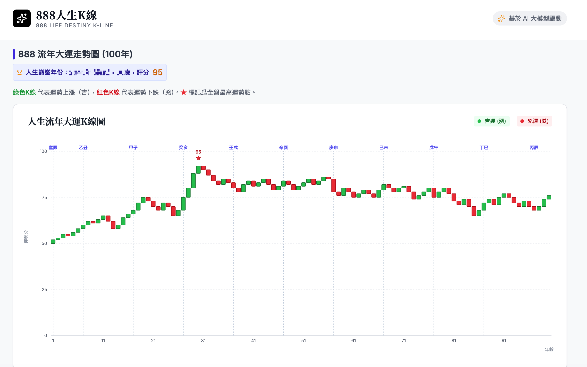

# 🔮 888 人生 K 線 (888 Life Destiny K-Line)

特別感謝原作者：[curionox/lifekline](https://github.com/curionox/lifekline.git)

> **基於 AI 大模型和傳統八字命理，將人生運勢以 K 線圖形式可視化展現。**

[](https://vercel.com/new/clone?repository-url=https://github.com/tbdavid2019/life-destiny-kline)

---

## ✨ 功能特點

1. **自動化八字計算**: 整合 `lunar-javascript`，只需輸入出生日期時間即可自動計算四柱與大運，無需手動排盤。
2. **可視化運勢**: 用股票 K 線圖展示 1-100 歲的人生運勢起伏，直觀呈現人生"牛市"與"熊市"。
3. **AI 深度批斷**: 支援直接調用大模型 API（如 Gemini, OpenAI），一鍵生成性格、事業、財富等報告。
4. **發展風水**: 提供方位建議、地理環境選擇及開運佈局。
5. **Web3 特供**: "幣圈交易運勢"板塊，包含暴富流年預測與交易風格建議。

---

## 📝 使用方法

1. **填寫出生信息** - 選擇姓名、性別及日期時間，系統會自動排盤。
2. **配置 API (可選)** - 輸入您的 API 金鑰、模型與基礎 URL。
3. **一鍵生成** - 點擊「生成 888 人生 K 線」，等待 AI 智能分析後即可查看詳盡報告。
4. **手動導入 (備選)** - 若您沒有 API Key，仍可使用提示詞生成後，將 JSON 數據貼回「手動導入」板塊。

---

## 🚀 一鍵部署

### Vercel 部署（推薦）

點擊下方按鈕一鍵部署到 Vercel：

[](https://vercel.com/new/clone?repository-url=https://github.com/tbdavid2019/life-destiny-kline)

### 本地運行

```bash
# 安裝依賴
npm install

# 啓動開發服務器
npm run dev

# 構建生產版本
npm run build
```

---

## ⚙️ 環境變數配置 (Vercel / Local)

為了系統安全與簡化使用者操作，您可以透過環境變數預設 API 參數。若設定了 `VITE_API_KEY`，前台將**自動隱藏**模型配置區域。

| 變數名稱 | 說明 | 範例值 |
| :--- | :--- | :--- |
| `VITE_API_KEY` | 您的 API 金鑰 (設定後會隱藏 UI 配置區) | `sk-xxxx...` |
| `VITE_API_BASE_URL` | API 代理地址 (可選) | `https://generativelanguage.googleapis.com/v1beta/openai` |
| `VITE_MODEL_NAME` | 指定大模型名稱 (可選) | `gemini-3-flash-preview` |

> [!TIP]
> 在 Vercel 中，請前往 **Settings -> Environment Variables** 進行配置。

---

## 🛠️ 技術棧

- **前端框架**: React 19 + Vite
- **UI 樣式**: TailwindCSS
- **圖表庫**: Recharts
- **AI 支持**: ChatGPT、Claude、Gemini 等任意 AI

---

## 📸 項目預覽




---

**免責聲明**: 本項目僅供娛樂與文化研究，命運掌握在自己手中。切勿迷信，請理性看待分析結果。
